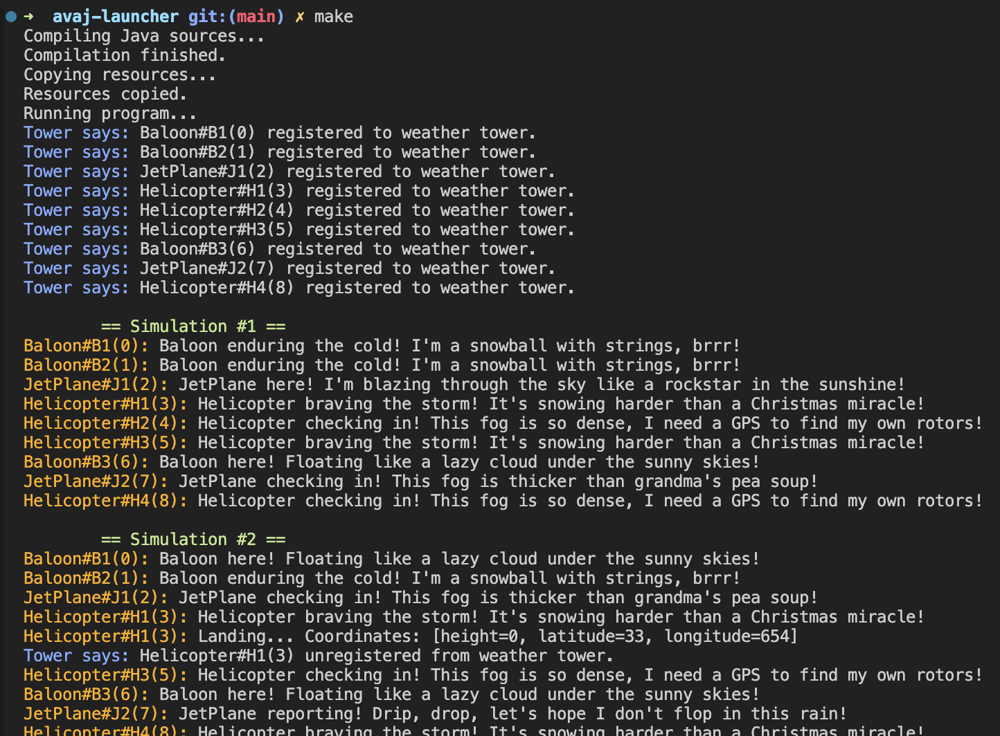

# AvajLauncher

AvajLauncher is a simulation program that models the behavior of various aircraft in different weather conditions.  
The program reads a scenario file, validates its content, and simulates the behavior of the aircraft based on the provided instructions.  
This project is developed as part of the 42 school curriculum, aiming to teach students about object-oriented programming, design patterns, and exception handling.

## Table of Contents

- [Installation](#installation)
- [Usage](#usage)
- [Project Structure](#project-structure)
- [Classes and Interfaces](#classes-and-interfaces)
- [Exception Handling](#exception-handling)
- [Additional Resources](#additional-resources)

## Installation

1. **Clone the repository:**
   ```sh
   git clone https://github.com/Kiripiro/avaj-launcher.git
   ```
2. **Navigate to the project directory:**
   ```sh
   cd avaj-launcher
   ```
3. **Build and run the project:**
   - Using the provided `run.sh` script:
     ```sh
     sh run.sh
     ```
   - Or using Make:
     ```sh
     make [optional target]
     ```

### Make Targets

- all: Compile the project, copy resources, and run the program.
  ```sh
    make all
  ```
- compile: Compile the Java source files.
  ```sh
  make compile
  ```
- copy-resources: Copy the resources to the build directory.
  ```sh
  make copy-resources
  ```
- run: Run the program.
  ```sh
  make run
  ```
- clean: Clean the compiled files.
  ```sh
  make clean
  ```
- fclean: Perform a full clean, including the build directory and _sources.txt_ file.
  ```sh
  make fclean
  ```
- re: Perform a full clean and then rebuild the project.
  ```sh
  make re
  ```

### Dependencies

Ensure you have the following installed:

- Java Development Kit (JDK) 8 or higher
- Make (optional, for using the Makefile)

## Usage

### Running the Simulation

**Make sure the project has been properly built before running the simulation.**

To run the simulation, use the following command:

```sh
java -classpath "build/classes:build/resources" com.atourret.avajLauncher.Main scenario.txt
```

### Example Output using _make_

Here is the output screenshot. 

### Example Scenario File

Here's an example of what a scenario file might look like:

```
25
Baloon B1 2 3 20
Baloon B2 1 8 66
JetPlane J1 23 44 32
Helicopter H1 654 33 20
Helicopter H2 22 33 44
Helicopter H3 98 68 99
Baloon B3 102 22 34
JetPlane J2 11 99 768
Helicopter H4 223 23 54
```

## Project Structure

```
src/main/
├── java/com/atourret/avajLauncher/
│   ├── exceptions/
│   │   ├── InvalidScenarioException.java
│   │   └── ParsingErrorException.java
│   ├── interfaces/
│   │   └── Flyable.java
│   ├── models/
│   │   ├── Aircraft.java
│   │   ├── AircraftFactory.java
│   │   ├── Baloon.java
│   │   ├── Coordinates.java
│   │   ├── Helicopter.java
│   │   ├── JetPlane.java
│   │   ├── Tower.java
│   │   └── WeatherTower.java
│   ├── parser/
│   │   ├── Parser.java
│   │   └── Validator.java
│   ├── scenario/
│   │   └── Scenario.java
│   ├── services/
│   │   └── WeatherProvider.java
│   └── Main.java
└── resources/
    └── scenario.txt
```

### Directory Descriptions

- **exceptions/**: Contains custom exception classes used for error handling.
- **interfaces/**: Defines interfaces that must be implemented by various models.
- **models/**: Contains the core classes representing different aircraft and their behaviors.
- **parser/**: Responsible for reading and validating the scenario file.
- **scenario/**: Manages the simulation logic.
- **services/**: Provides weather-related services.
- **Main.java**: Entry point of the application.
- **resources/**: Contains external files such as the **scenario.txt** file.

## Classes and Interfaces

### Main.java

The entry point of the application.  
It validates the command-line arguments, parses the scenario file, and starts the simulation.

### Scenario.java

Singleton class that manages the simulation.  
It holds the list of aircraft and the number of simulations to run.

### Parser.java

Responsible for reading and validating the scenario file.  
It parses the file and initializes the Scenario instance with the appropriate data.

### Flyable.java

Interface that must be implemented by all aircraft.  
It defines methods for updating conditions and registering with the WeatherTower.

### Aircraft Models

- **Aircraft.java**: Base class for all aircraft types.
- **Baloon.java, Helicopter.java, JetPlane.java**: Specific implementations of different aircraft.

## Exception Handling

### ParsingErrorException.java

Thrown when there is an error in parsing the scenario file.

### InvalidScenarioException.java

Thrown when the scenario file contains invalid data.

## Additional Resources

### UML Diagram

Here is the UML diagram we had to implement. 

### School Subject

The detailed project description can be found in the [assets/en.subject.pdf](assets/en.subject.pdf) file.
